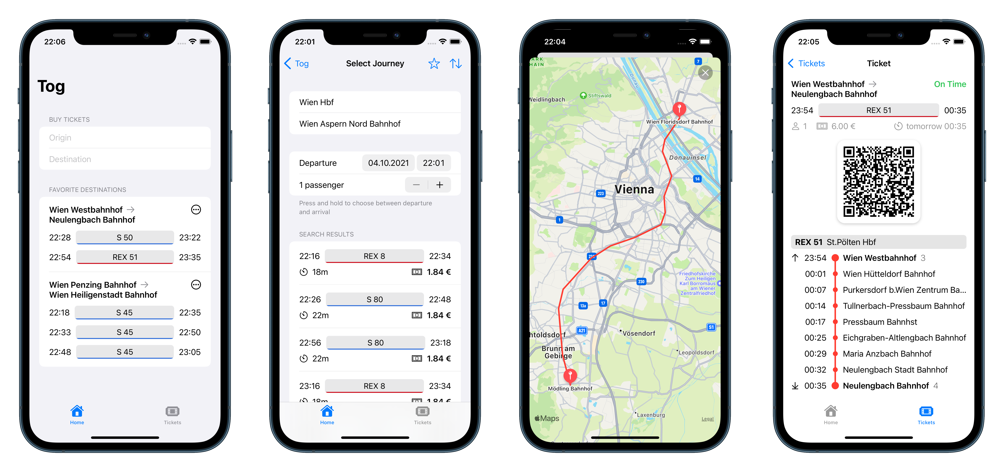

# tog

An iOS app for railway services.



This is a project I've been doing in my free time. It consists of two applications: an iOS app and a backend server.
The server uses ÖBB's open data to build its database – this project however is in no way official.

## Features
- Searching for stations & available tickets
- Favorite destinations for a quick preview of next departures
- Preview of a journey with all stops and transfers & a map of the route
- 'Buying' tickets (simulated)

## Technologies
- iOS App:
  - SwiftUI & interfacing with UIKit
  - MapKit
  - XCTest
  - CocoaPods
- Server:
  - Spring & H2
  - Lombok, MapStruct, SuperCSV
  - Maven
- SwiftLint, GitHub Workflows, Codecov

## Limitations
- No support for iOS Dynamic Type (font resizing) yet
- Tickets are stored locally yet
- Only direct journeys (no transfers) are searchable yet

## Running

### Requirements
- macOS 10.15.4+, Xcode 12+, CocoaPods
- Java JDK 11, Maven
- For running on an iPhone: iOS 14+, ngrok

### Running in a simulator
Install the dependencies with `CocoaPods` using the following command in the project directory:
```
pod install
```
And open the generated `.xcworkspace` in Xcode, where you can start the app in the simulator.

To start the server and generate the database, run:
```
cd server/railway
mvn spring-boot:run -Dspring-boot.run.profiles=datagen
```
After doing that once, you can start the server without the `datagen` profile.

### Running on a physical device
The iOS app is configured to send requests to `localhost`, which will not work if you're running the app on an iPhone.
You will need to relay traffic through `ngrok`. In `/server/railway`, run:
```
ngrok http 8080
```
`ngrok` will display an address that can be used for forwarding. Copy the secure (`https`) one, open `Info.plist` in
Xcode and paste the address in the `SERVER_URL` field. As long as the server and `ngrok` are running, you can run the
iOS app on a physical device.
